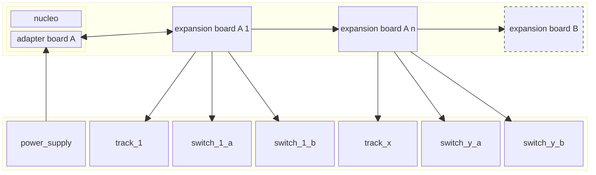

# System architecture
The `adapter board A` is connected to a nucleo 64 board.
The `adapter board A` provides a 

## Connection between expansion boards
Required Wires:
1. Drive Ground
2. Drive voltage
3. Switch voltage
4. Vcc (3V3 or 5V?)
5. D_Ground
6. MOSI
7. MISO
8. CLK